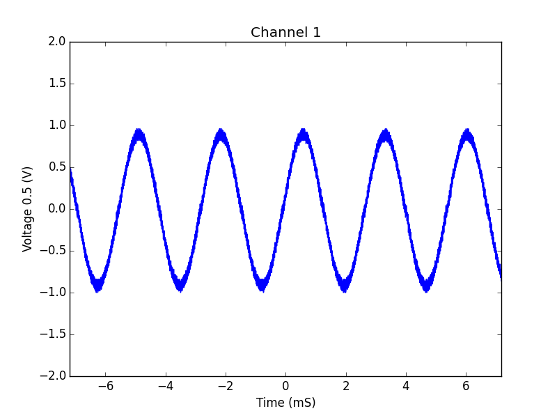

# rigol_ds1000z_tools

Simple script to acquire data from a Rigol DS1000z oscilloscope using Python

by now, juste a script and a few class to retrive data from rigol scope.

script only read data from the scope. So setup your signal and retrive it with this script.

